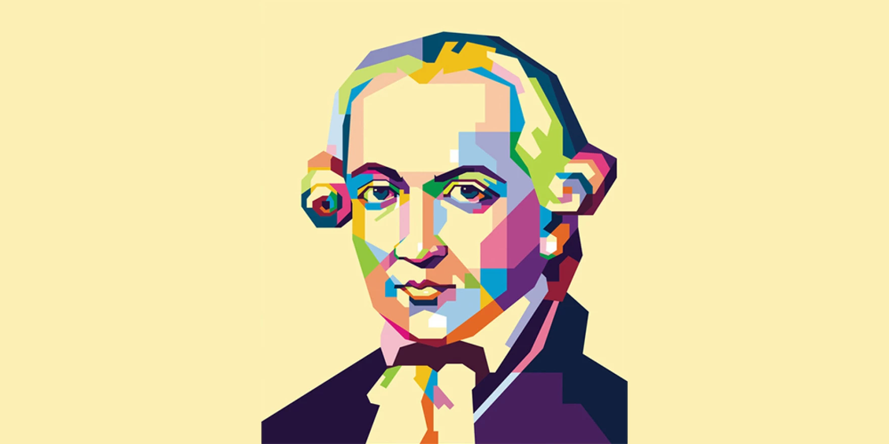
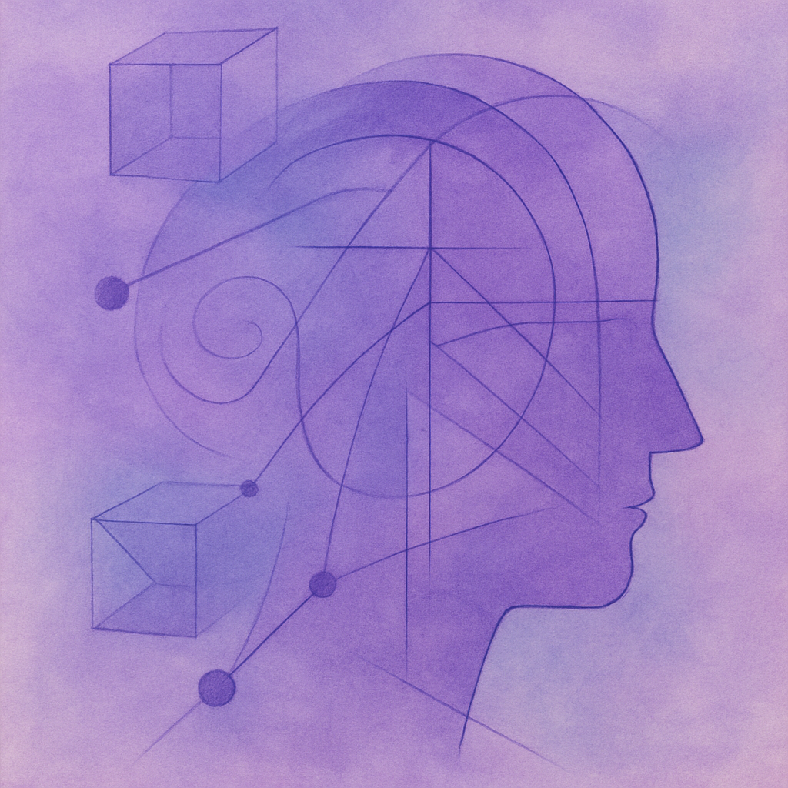

My research explores the intersections of historical philosophy, cognitive science, and contemporary theoretical debates. I aim to connect rigorous analysis of classical texts with innovative approaches to understanding the mind, knowledge, and law.

<!-- ===== Kant ===== -->
<h2 id="kant" style="font-size:1.6em; margin-top:40px; border-left:4px solid #1B3A57; padding-left:10px;">Kant</h2>

Focused studies on Kantian philosophy, including epistemology, metaphysics, and moral theory. This line of research investigates how Kant’s ideas can illuminate contemporary debates in philosophy of mind and ethics.

<figure class="figure-torn">
  
</figure>

Image credit: Example Source

Paper 1 — Synthetic A Priori & Representation

Examines the role of synthetic a priori judgments in contemporary theories of representation, clarifying their relevance to current models of perception and concept acquisition.

Paper 2 — Autonomy, Law, and Agency

Revisits Kant’s account of autonomy to articulate a unified picture of agency that bridges moral psychology and legal responsibility.

Paper 3 — (Optional)

Add a brief 2–3 sentence summary here.

<!-- ===== History and Philosophy of Psychology ===== -->
<h2 id="history-psych" style="font-size:1.6em; margin-top:40px; border-left:4px solid #1B3A57; padding-left:10px;">History and Philosophy of Psychology</h2>

Exploring the development of psychological theories and their philosophical foundations. This research bridges historical perspectives with modern cognitive theories, highlighting conceptual continuity and transformation.

<figure class="figure-torn">
  
</figure>

Image credit: Example Source

Paper 1 — From Faculty Psychology to Mechanisms

Traces shifts from faculty psychology to mechanistic explanations, showing how older taxonomies still scaffold present-day research programs.

Paper 2 — Introspection, Measurement, and Method

Assesses the philosophical status of introspection and the emergence of measurement norms, relating them to current methodological debates.

<!-- ===== Philosophy of Cognitive Science ===== -->
<h2 id="cogsci" style="font-size:1.6em; margin-top:40px; border-left:4px solid #1B3A57; padding-left:10px;">Philosophy of Cognitive Science</h2>

Investigating questions raised by contemporary cognitive science, including representation, consciousness, and computational models of the mind. The aim is to integrate rigorous conceptual analysis with empirical insights.

<figure class="figure-torn">
  
</figure>

Image credit: Example Source

Paper 1 — Levels of Computation & Explanation

Clarifies levels-based explanation in cognitive models, situating computational, algorithmic, and implementational claims within a single normative frame.

Paper 2 — Perception, Prediction, and Concept Use

Connects predictive processing accounts with concept acquisition and perceptual learning, arguing for a principled link between inference and representation.

Paper 3 — (Optional)

Add a brief 2–3 sentence summary here.

<!-- ===== Legal Philosophy ===== -->
<h2 id="legal" style="font-size:1.6em; margin-top:40px; border-left:4px solid #1B3A57; padding-left:10px;">Legal Philosophy</h2>

Analyzing philosophical foundations of law, justice, and legal reasoning. The work examines how normative theories inform legal practice and institutional design.

<figure class="figure-torn">
  
</figure>

Image credit: Example Source

Paper 1 — Normativity and Legal Reasons

Develops a unified account of practical reasons that links legal obligation with moral normativity without collapsing the two.

Paper 2 — Responsibility, Agency, and Evidence

Explores agency-sensitive models of responsibility and how evidential standards can reflect underlying normative commitments.

