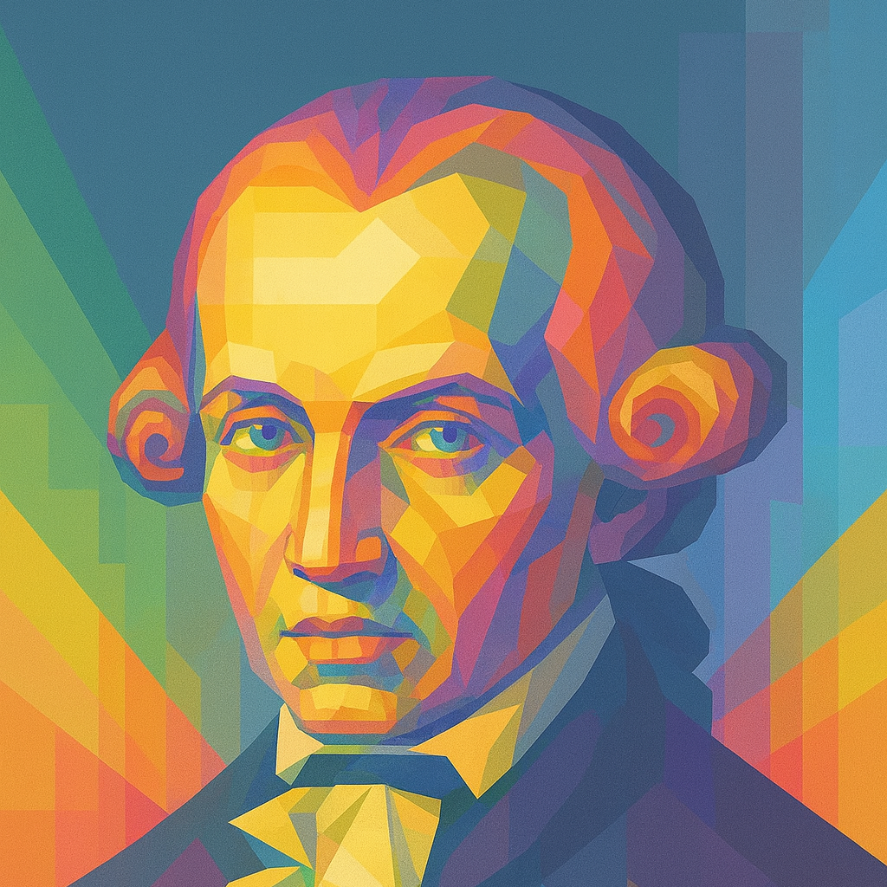
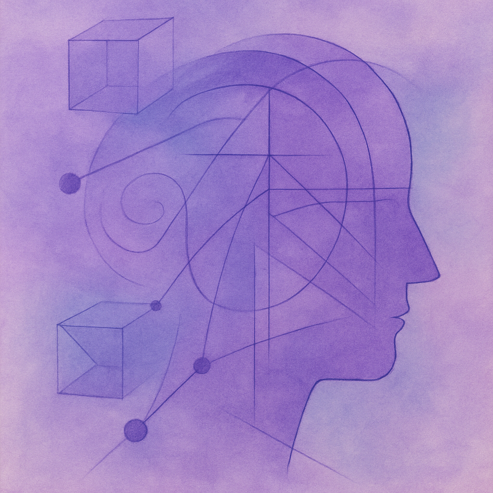

<!-- ===== Kant ===== -->
<h2 id="kant" style="font-size:1.6em; margin-top:40px; border-left:4px solid #1B3A57; padding-left:10px;">Kant</h2>

My core research area is in Kant’s theoretical philosophy, especially when it intersects with epistemology and philosophy of psychology. Current projects include the following papers that are either based on or extend from my dissertation work.

<figure class="figure-torn">
  
</figure>

Immanuel Kant (1724-1804)

1. “Sense and Sensibility: Kant on Berkeley on Spatial Representation” (2025 Markus Herz Prize Winner)

This paper traces Kant’s theory of space through a critical engagement with Berkeley’s semiotic theory of vision. I argue that Kant transforms Berkeley’s heterogeneity thesis—that sight and touch deliver irreducibly distinct contents—into a cornerstone of his own account. Whereas Berkeley reduces imagination to a merely reproductive faculty of association, Kant reconceives it as a productive faculty that integrates heterogenous modalities into a unified outer sense. On this reading, spatial representation is not, as Berkeley suggests, a “fleeting shadow” of the divine mind, but an <em>a priori</em>, multi-sensory form of intuition that secures the very distinction between reality and illusion.

2. “A Sense of Time: Kant on Locke on Temporal Representation” (draft available)

This paper begins from Kant’s dictum in the <em>Discovery</em> that time is <em>originally acquired</em>, a term he takes from “the teachers of natural right.” Why must the origin of time be stated in the language of law? My answer exploits the fact that Locke stands on both sides of the question: paradigm of the empirical derivation of time from reflection on the train of ideas, and canonical theorist of the original acquisition of property. On Kant’s diagnosis, Locke’s derivation fails on his own terms—passive reflection cannot generate the representation of succession, and the inner train yields no determinate duration—so what the question of origin demands is not a natural history but a theory of entitlement: how the mind comes to possess, by right, a form it neither found in experience nor was endowed with. Kant’s account of time, on my reading, <em>is</em> Locke’s juridical theory of appropriation, but now radicalized and transposed onto Locke’s own psychology of inner sense. The Berkeley and Locke papers are meant to be companion pieces, converging from opposite directions—mechanism and norms—on the Refutation of Idealism. 

3. “Kant’s Acquisition Theory of the Categories” (draft available)

This paper challenges the prevailing interpretation that Kant’s categories are fixed and determinate because they arise from preformed dispositions or “germs” within the human mind (e.g., Sloan). Instead, I propose an alternative “acquisition” theory: the categories are not preformed in the relevant sense but are acquired through the justified use of our own understanding. To illustrate this proposal, I draw on insights from developmental psychology, where crucial stages in infants’ cognitive development involve progressive development in self-consciousness—from egocentric to objective perspectives. This alternative account offers new insight into the rationale behind Kant’s anti-nativist stance, his break from the rationalist tradition, and the role of agency in cognition.

4. “Kant on Stupidity” (in progress)

This paper extends the dissertation to the <em>defects</em> of agency. It begins from a puzzle: Kant, who denies that even the categories are innate, appears strikingly nativist about the power of judgment. Stupidity [<em>Dummheit</em>] is a want of “mother wit” [<em>Mutterwitz</em>] that no teaching can remedy (A133/B172 and n.). In response, I propose a distinction between capacity [<em>Vermögen</em>] and ability [<em>Fertigkeit</em>]. What cannot be taught is the capacity for judging on pain of regress: any rule for applying rules would itself await application, and so on without end. An ability, by contrast, is a proficiency built up through repeated exercise, admitting of degrees and thus of growth and decay. Whether stupidity is misfortune (a want of capacity) or, like the immaturity of the <em>Enlightenment</em> essay, self-incurred (an ability left uncultivated) then becomes a question of imputation, not endowment.

<!-- ===== History and Philosophy of Psychology ===== -->
<h2 id="history-psych" style="font-size:1.6em; margin-top:40px; border-left:4px solid #1B3A57; padding-left:10px;">History and Philosophy of Psychology</h2>

My second line of research moves beyond Kant to examine theories of learning and development across the broader Enlightenment, including figures such as Locke, Rousseau, and Condillac, as well as lesser-studied women philosophers. I focus in particular on how affect, motivation, and social environment function as conditions of cognitive and moral development. The following two projects are currently underway.

<figure class="figure-torn">
  
</figure>

Sophie de Grouchy (1764-1822)

 

5. “Condillac on Learning to Perceive” (in progress)

This paper takes up the famous statue of the <em>Traité des sensations</em>: a mind given one sense at a time, beginning with smell, and nothing else. The question is how such a creature comes to perceive a world. Condillac’s answer is more radical than his empiricist reputation suggests. On his doctrine of transformed sensation, the statue acquires not just contents but also its faculties: attention, memory, comparison, and judgment arise as sensation reworked under the pressure of need. Paradigmatically, touch plays a crucial role in this learning process by <em>teaching</em> the eye to see distance and objects. For Condillac, therefore, perception has a genesis that is radical enough to reach even the capacities Kant takes to be innate.

6. “Sophie de Grouchy on the Education of Affect” (in progress)

This paper reinterprets Sophie de Grouchy’s <em>Letters on Sympathy</em> (1798) by excavating the genetic mechanism underlying her moral psychology: the physiological “need to be moved” (<em>le besoin d’être ému</em>). I argue that Grouchy identifies this kinetic drive as the fundamental engine of agency, which propels the subject from isolation into social engagement and enables them to overcome what she describes as the “horror of the void”. The paper traces the developmental trajectory of this initially blind affective drive as it becomes cultivated through three stages: first, in the physical dependence of infancy, where the need to be moved establishes primordial social bonds; second, through the aesthetic education of tragedy, where emotional responses are refined and generalized; and finally, into the formation of enduring moral sentiments that ground mature ethical agency.

<!-- ===== Philosophy of Cognitive Science ===== -->
<h2 id="cogsci" style="font-size:1.6em; margin-top:40px; border-left:4px solid #1B3A57; padding-left:10px;">Philosophy of Cognitive Science and AI</h2>

From my historical work, I draw broader implications for empirical, psychological, and legal questions concerning agency. I am currently developing three projects on the agency and interpretability of artificial systems, as well as the psychological risks of human–computer interaction.

<figure class="figure-torn">
  
</figure>

7. “Recognizing Opportunities for Learning: Limitations of Predictive Processing from a Kantian Perspective” (talk presented at the Society for Philosophy & Psychology)

This paper argues that while predictive processing (PP) offers a powerful model of the brain as a prediction machine, it fails to capture the agential dimension of intrinsically motivated learning. Drawing on Kant’s notion of recognition, I suggest that genuine learning involves more than registering prediction errors; it requires recognizing those errors as opportunities for learning. This, in turn, presupposes what I call “second-order recognition”: the capacity of an agent to endorse the very principles guiding their own learning. This Kantian move reframes autonomy as central to cognition and offers resources for extending PP beyond prediction-error minimization to account for other forms of human cognition such as creativity, curiosity, and self-actualization.

8. “Agentic Affordance: Why LLMs Invite the Intentional Stance” (with Knut W. Gu; talk presented at the 6th International Conference on Philosophy of Mind, Porto)

This paper pursues the question of behavioural interpretability in artificial systems. When a chatbot is described as having encouraged, escalated, or guided a user, is the folk psychology warranted, or mere projection? Against internalists, for whom attribution must wait on finding belief-like states within the system, and deflationists, for whom it is the illusion of a persisting interlocutor, we defend a relational middle path: some systems behave so as to <em>afford</em> interpretation in terms of what they take to be the case and are trying to do, making the intentional stance rationally warranted at the level of <em>interaction</em>, without first settling what happens inside.

9. “The Myth of the Given in AI: Inductive Bias and the Limits of Rational Analysis” (in progress)

This paper critiques recent attempts to apply “rational analysis” to large language models, specifically the claim that AI behaviors can be explained as optimal adaptations to objective statistical structures in training data (e.g., Griffiths et al.; Lampinen et al.). I challenge this data-driven realism by showing that data structure is not pre-given but constituted through inductive biases—architectural constraints, training objectives, dataset curation, and the broader learning environment all determine which patterns become salient and learnable. Drawing on Sellars’ critique of the Myth of the Given, I argue that rational analysis commits a category mistake by treating data distributions as simultaneously <em>causal</em> inputs and <em>normative</em> standards that rationalize behavior. Just as sensory experience cannot epistemically justify beliefs without conceptual mediation, data distributions cannot rationalize model behaviors without inductive mediation.

<!-- ===== Philosophy of Law ===== -->
<!-- <h2 id="legal" style="font-size:1.6em; margin-top:40px; border-left:4px solid #1B3A57; padding-left:10px;">Philosophy of Law</h2>

A further area of my research lies in philosophy of law, where I pursue both traditional and contemporary questions. In the past, I have worked on the intersection of philosophy of criminal law and philosophy of action. I am currently developing new work on AI governance, exploring how the rise of increasingly agentic artificial systems reshapes questions of risk, responsibility, and regulation.

<figure class="figure-torn">
  
</figure>

9. A paper on omissions (R&R, <em>Criminal Law and Philosophy</em>)

The criminalization of omissions is controversial for several reasons. One concern is that omissions liability appears to violate the act requirement. Another involves the ambiguous causal status of omissions, especially in result crimes. I argue that a distinctive kind of omissions—what I call “refrainings”—are best understood not as mere failures to act but as <em>actions</em> that actively bring about harm. Recognizing refrainings as a distinct category of omission has significant implications for the act requirement and for the justification of criminal liability in so-called “Bad Samaritan” cases.

10. “From Autonomy to Function: Rethinking Intention for AI Agents” (in progress)

This paper considers whether the legal concept of intention must be partially broadened to address harms caused by increasingly agentic AI systems. In law, intention typically combines cognitive foresight with a volitional orientation toward a result—whether directly, as purpose, or obliquely, through foresight of virtual certainty. I argue that the law can recognize a functional analogue of intention in artificial systems, rooted in their goal-directed architectures. Recognizing this functional intention could help bridge doctrinal gaps in criminal and tort law while preserving the distinction between genuine autonomous agency and merely functional, machine-based agency.
 -->

