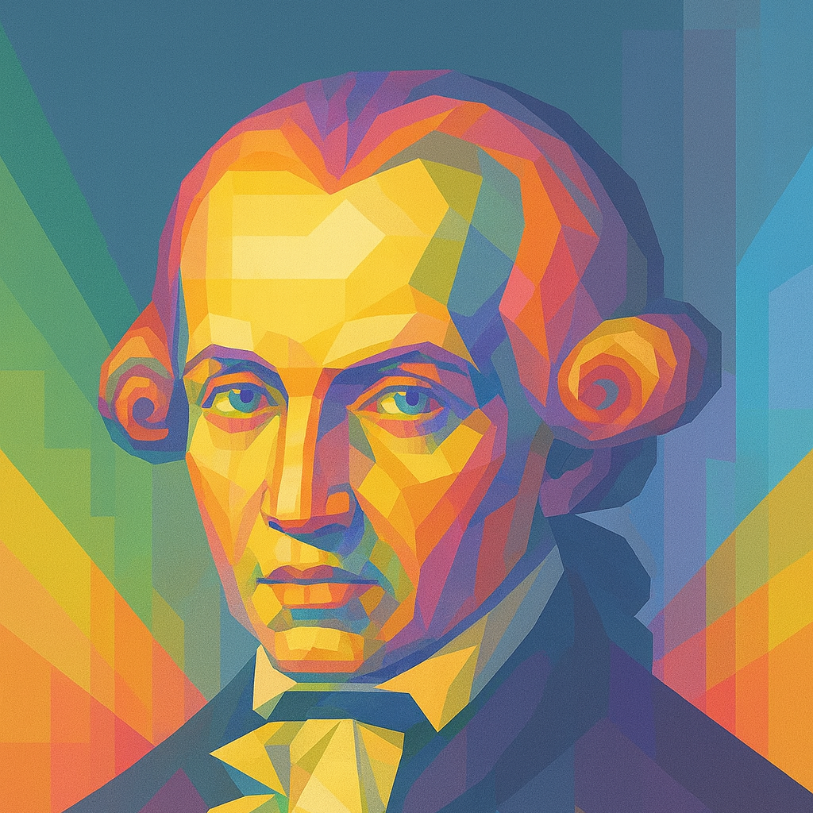
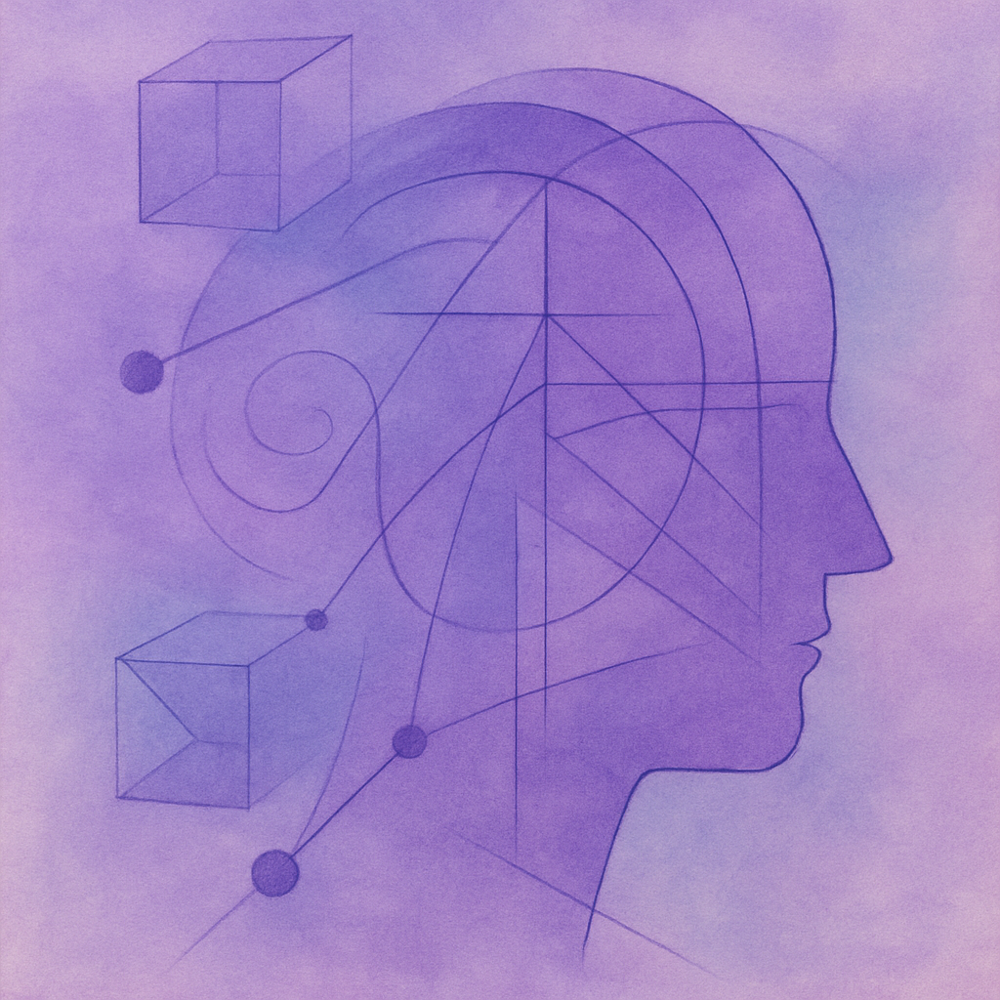

What does it mean to be the agent of your own cognition? Where does receptivity end and activity begin? And on what grounds can a mind regard its representations as its own: as achievements for which it can be credited, rather than as endowments for which it cannot? My research pursues these questions, first, in Kant’s critical philosophy, read through his engagements with Locke, Berkeley, and Leibniz, and then in the wider Enlightenment. Across both contexts, I defend a <em>constructivist</em> thesis about agency: a mind is not born an agent but becomes one, and even its most basic representations are acquired in the process of that becoming.

<!-- ===== Kant ===== -->
<h2 id="kant" style="font-size:1.6em; margin-top:40px; border-left:4px solid #1B3A57; padding-left:10px;">Kant</h2>

My core research area is Kant’s theoretical philosophy, particularly his account of agency and cognitive development. Current projects include the following papers that are either based on or extend from my dissertation work.

<figure class="figure-torn">
  
</figure>

Immanuel Kant (1724-1804)

1. “Sense and Sensibility: Kant on Berkeley on Spatial Representation” (2025 Markus Herz Prize Winner)

This paper traces Kant’s theory of space through a critical engagement with Berkeley’s semiotic theory of vision. I argue that Kant transforms Berkeley’s heterogeneity thesis—that sight and touch deliver irreducibly distinct contents—into a cornerstone of his own account. Whereas Berkeley reduces imagination to a merely reproductive faculty of association, Kant reconceives it as a productive faculty that integrates heterogenous modalities into a unified outer sense. This reading yields two payoffs, empirical externality and a primary/secondary distinction drawn within appearance, that together furnish a genuine answer to Berkeley.

2. “A Sense of Time: Kant on Locke on Temporal Representation” (draft available)

This paper begins from Kant’s dictum in the <em>Discovery</em> that time is <em>originally acquired</em>, a term he takes from “the teachers of natural right.” Why must the origin of time be stated in the language of law? My answer exploits the fact that Locke stands on both sides of the question: paradigm of the empirical derivation of time from reflection on the train of ideas and canonical labor theorist of property. On Kant’s diagnosis, Locke’s derivation fails on his own terms—passive reflection cannot generate the representation of succession, and the inner train yields no determinate duration—so what the question of origin demands is not a natural history but a theory of entitlement: how the mind comes to possess, by right, a form it neither found in experience nor was endowed with. Kant’s answer reworks the natural-law concept of original acquisition through a critique of Locke’s labor theory and then applies it to the very faculty from which Locke had derived time: inner sense.

3. “Kant’s Acquisition Theory of the Categories” (draft available)

This paper challenges the influential “preformation” reading, on which the categories arise from innate germs and dispositions. This reading, I argue, collapses Kant into the Leibnizian nativism he explicitly rejects, and merely relocates arbitrariness from thought to biology. Instead, I propose an acquisition theory: the categories are acquired as we impose extra-logical constraints on the logical forms under the objective unity of apperception. Piaget’s A-not-B task offers an illustration here: the infant’s acquisition of object permanence is a “decentration” from an egocentric (hence subjective) standpoint to an objective one. What is ultimately at stake is our standing as cognizers. On the preformation reading, our most basic concepts are inherited; on the acquisition theory, they are our own achievements.

4. “Kant on Madness” (in progress)

This paper extends the account offered in the dissertation to the defects of agency. Kant holds that the only universal mark of madness is the loss of common sense (<em>sensus communis</em>) and its replacement by a private sense (<em>sensus privatus; Anth.</em> 7:219). The criterion is striking: it identifies madness not by a missing capacity or a bodily lesion but by a broken relation to others, whose judgments can no longer correct one’s own. Yet Kant also holds that madness, once it has broken out, is incurable, and grounds this in a hereditary germ (7:217). These two commitments seem to pull apart. If sanity consists in standing in a certain relation to a community of judges, its loss should in principle admit of social repair; if madness springs from a hereditary germ, it should not. The paper takes up this tension by following the social thread from the 1764 <em>Essay on the Maladies of the Head</em>, where civil society itself breeds derangement, to the third <em>Critique</em> and the Enlightenment writings, where thinking in community is a condition of thinking correctly at all.

<!-- ===== History and Philosophy of Psychology ===== -->
<h2 id="history-psych" style="font-size:1.6em; margin-top:40px; border-left:4px solid #1B3A57; padding-left:10px;">History and Philosophy of Psychology</h2>

Building on the dissertation, my next line of research moves beyond Kant to examine the affective and social conditions of cognitive and moral development in the wider Enlightenment, focusing on Locke, Rousseau, and Sophie de Grouchy, whose <em>Letters on Sympathy</em> (1798) reworks Adam Smith’s moral sentimentalism and remains underexplored. Two projects are currently underway.

<figure class="figure-torn">
  
</figure>

Sophie de Grouchy (1764-1822)

 

5. “Locke on Prejudice” (in progress)

This paper begins from Locke’s break with the prevailing early modern view. For Descartes and his successors, prejudice is a judgment: a hasty assent, often made in childhood, which the will could have withheld. For Locke, it is largely not a judgment at all but a settled habit of thought, first laid down in childhood by custom, education, and company, then fixed by the association of ideas beyond the reach of argument, and defended afterward by interest, passion, and party (<em>Essay</em> I.iii, II.xxxiii, IV.xx; <em>Conduct</em>). Indeed, his polemic against innate principles already contains a theory of prejudice: what passes for innate is what was imbibed before memory and never examined. Prejudice is thus not an aberration of a sound mind but the ordinary condition of any mind formed in society, and its genealogy is therefore the genealogy of cognition itself.

6. “Sophie de Grouchy on the Education of Affect” (in progress)

This paper reinterprets Sophie de Grouchy’s <em>Letters on Sympathy</em> (1798) by excavating the genetic mechanism underlying her moral psychology: the physiological “need to be moved” (<em>le besoin d’être ému</em>). I argue that Grouchy identifies this kinetic drive as the fundamental engine of agency, which propels the subject from isolation into social engagement and enables them to overcome what she describes as the “horror of the void.” The paper traces the developmental trajectory of this initially blind affective drive as it becomes cultivated through three stages: first, in the physical dependence of infancy, where the need to be moved establishes primordial social bonds; second, through the aesthetic education of tragedy, where emotional responses are refined and generalized; and finally, into the formation of enduring moral sentiments that ground mature ethical agency.

<!-- ===== Philosophy of Cognitive Science ===== -->
<h2 id="cogsci" style="font-size:1.6em; margin-top:40px; border-left:4px solid #1B3A57; padding-left:10px;">Philosophy of Cognitive Science and AI</h2>

From my historical work, I draw broader implications for empirical, psychological, and legal questions concerning agency. I am currently developing three projects on the agency and interpretability of artificial systems, and the psychological risks of human–computer interaction.

<figure class="figure-torn">
  
</figure>

7. “Recognizing Opportunities for Learning: Limitations of Predictive Processing from a Kantian Perspective” (talk presented at the Society for Philosophy & Psychology)

This paper argues that while predictive processing (PP) offers a powerful model of the brain as a prediction machine, it fails to capture the agential dimension of intrinsically motivated learning. Drawing on Kant’s notion of recognition, I suggest that genuine learning involves more than registering prediction errors; it requires recognizing those errors as opportunities for learning. This, in turn, presupposes what I call “second-order recognition”: the capacity of an agent to endorse the very principles guiding their own learning. This Kantian move reframes autonomy as central to cognition and offers resources for extending PP beyond prediction-error minimization to account for other forms of human cognition such as creativity, curiosity, and self-actualization.

8. “Agentic Affordance: Why LLMs Invite the Intentional Stance” (with Knut W. Gu; talk presented at the 6th International Conference on Philosophy of Mind, Porto)

This paper pursues the question of behavioural interpretability in artificial systems. When a chatbot is described as having encouraged, escalated, or guided a user, is the folk psychology warranted, or mere projection? Against internalists, for whom attribution must wait on finding belief-like states within the system, and deflationists, for whom it is the illusion of a persisting interlocutor, we defend a relational middle path: some systems behave so as to <em>afford</em> interpretation in terms of what they take to be the case and are trying to do, making the intentional stance rationally warranted at the level of <em>interaction</em>, without first settling what happens inside.

9. “The Myth of the Given in AI: Inductive Bias and the Limits of Rational Analysis” (in progress)

This paper critiques recent attempts to apply “rational analysis” to large language models, specifically the claim that AI behaviors can be explained as optimal adaptations to objective statistical structures in training data (e.g., Griffiths et al.; Lampinen et al.). I challenge this data-driven realism by showing that data structure is not pre-given but constituted through inductive biases—architectural constraints, training objectives, dataset curation, and the broader learning environment all determine which patterns become salient and learnable. Drawing on Sellars’ critique of the Myth of the Given, I argue that rational analysis commits a category mistake by treating data distributions as simultaneously <em>causal</em> inputs and <em>normative</em> standards that rationalize behavior. Just as sensory experience cannot epistemically justify beliefs without conceptual mediation, data distributions cannot rationalize model behaviors without inductive mediation.

<!-- ===== Philosophy of Law ===== -->
<!-- <h2 id="legal" style="font-size:1.6em; margin-top:40px; border-left:4px solid #1B3A57; padding-left:10px;">Philosophy of Law</h2>

A further area of my research lies in philosophy of law, where I pursue both traditional and contemporary questions. In the past, I have worked on the intersection of philosophy of criminal law and philosophy of action. I am currently developing new work on AI governance, exploring how the rise of increasingly agentic artificial systems reshapes questions of risk, responsibility, and regulation.

<figure class="figure-torn">
  
</figure>

9. A paper on omissions (R&R, <em>Criminal Law and Philosophy</em>)

The criminalization of omissions is controversial for several reasons. One concern is that omissions liability appears to violate the act requirement. Another involves the ambiguous causal status of omissions, especially in result crimes. I argue that a distinctive kind of omissions—what I call “refrainings”—are best understood not as mere failures to act but as <em>actions</em> that actively bring about harm. Recognizing refrainings as a distinct category of omission has significant implications for the act requirement and for the justification of criminal liability in so-called “Bad Samaritan” cases.

10. “From Autonomy to Function: Rethinking Intention for AI Agents” (in progress)

This paper considers whether the legal concept of intention must be partially broadened to address harms caused by increasingly agentic AI systems. In law, intention typically combines cognitive foresight with a volitional orientation toward a result—whether directly, as purpose, or obliquely, through foresight of virtual certainty. I argue that the law can recognize a functional analogue of intention in artificial systems, rooted in their goal-directed architectures. Recognizing this functional intention could help bridge doctrinal gaps in criminal and tort law while preserving the distinction between genuine autonomous agency and merely functional, machine-based agency.
 -->

