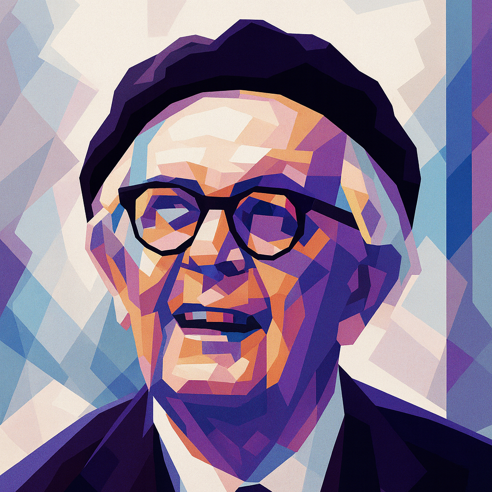

<!-- ===== Kant ===== -->
<h2 id="kant" style="font-size:1.6em; margin-top:40px; border-left:4px solid #1B3A57; padding-left:10px;">Kant</h2>

My core research area is in Kant’s theoretical philosophy, especially when it intersects with epistemology and philosophy of psychology. Current projects include the following papers that are either based on or extend from my dissertation work.

<figure class="figure-torn">
  
</figure>

Immanuel Kant (1724-1804)

1. “Sense and Sensibility: Kant on Berkeley on Spatial Representation” (Markus Herz Prize nominee)

This paper traces Kant’s theory of space through a critical engagement with Berkeley’s semiotic theory of vision. I argue that Kant transforms Berkeley’s heterogeneity thesis—that sight and touch yield irreducibly distinct contents—into a cornerstone of his own account. Whereas Berkeley reduces imagination to a merely reproductive faculty of association, Kant reconceives it as a productive faculty that integrates heterogenous modalities into a single, unified outer sense.

2. “Laboring Time: Kant on Locke on Inner Sense” (draft available)

This paper reconstructs Kant’s theory of time through a critical engagement with Locke’s account of inner sense. I argue that Kant repurposes Locke’s juridical notion of “original acquisition” to describe not the appropriation of external objects but the acquisition of the very forms of intuition. On this reading, acquisition becomes at once a labor of annexation, through which the manifold of intuition is appropriated as “ours”, and a labor of constitution, by which the temporal form itself is produced.

3. “Kant’s Acquisition Theory of the Categories” (draft available)

This paper challenges the “preformation” theory of the categories, which holds that the categories are fixed and determinate because they stem from preformed dispositions or “germs” within the mind. Instead, I propose that the categories are acquired through the justified use of our own understanding, in accordance with what I identify as an epistemic principle of cognition. This interpretation illuminates Kant’s anti-nativist stance, clarifies his crucial break from the rationalist tradition, and highlights the crucial role of epistemic agency in human cognition.

4. “Kant on Epistemic Luck” (in progress)

This paper addresses the relatively neglected problem of epistemic luck in Kant, arguing that it poses a deeper challenge than moral luck because truth, unlike moral worth, depends on an external success condition beyond the agent’s control. I propose that for Kant, epistemic luck exposes an inevitable gap between the empirical standpoint of contingency and the noumenal standpoint of rational agency. Yet it is precisely in this gap that epistemic responsibility, critique, and self-correction become possible: without epistemic luck, there would be no need for the active exercise of reason or the practice of justification.

<!-- ===== History and Philosophy of Psychology ===== -->
<h2 id="history-psych" style="font-size:1.6em; margin-top:40px; border-left:4px solid #1B3A57; padding-left:10px;">History and Philosophy of Psychology</h2>

A second, emerging area of my research traces the historical development of theories of learning and education, focusing on Enlightenment thinkers—including Locke, Rousseau, and Condillac, as well as marginalized women philosophers such as Sophie de Grouchy. This line of work aims to uncover a continuity in how these thinkers conceive of the child as a cognitive agent-in-formation and of learning as a central site of both cognitive and moral development. I am currently developing this area along the following themes.

<figure class="figure-torn">
  
</figure>

Jean Piaget (1896-1980)

 

5. “The Discovery of the Child: Locke on Education” (in progress)

In <em>Some Thoughts Concerning Education</em> (1693), Locke insists that learning must be made pleasant, warning that fear, punishment, or rote drills leads to aversion rather than understanding. I propose that Locke treats pleasure and play as the affective ground of cognition; without them, rational capacities cannot fully develop. On this reading, Locke offers an early theory of intrinsic motivation in cognitive development that anticipates Piaget’s play-based constructivism.

6. “Sophie de Grouchy on the Education of Affect” (in progress)

This paper reinterprets Sophie de Grouchy’s <em>Letters on Sympathy</em> (1798) by excavating the genetic mechanism underlying her moral psychology: the physiological “need to be moved” (<em>le besoin d’être ému</em>). I argue that Grouchy identifies this kinetic drive as the fundamental engine of agency, which enables the subject to overcome the “horror of the void” and to be propelled from isolation into social engagement. The paper traces the developmental trajectory of this initially blind affective drive as it is cultivated from the physical dependence of infancy, through the aesthetic education of tragedy, and into the formation of enduring moral sentiments.

<!-- ===== Philosophy of Cognitive Science ===== -->
<h2 id="cogsci" style="font-size:1.6em; margin-top:40px; border-left:4px solid #1B3A57; padding-left:10px;">Philosophy of Cognitive Science and AI</h2>

A third, emerging area of my research engages with contemporary philosophy of cognitive science and AI, focusing on how insights from Kant and other historical figures can illuminate current debates about cognition, learning, and agency. I am currently developing this area along the following themes.

<figure class="figure-torn">
  
</figure>

7. “Recognizing Opportunities for Learning: Limitations of Predictive Processing from a Kantian Perspective” (talk presented at the Society for Philosophy & Psychology)

This paper argues that predictive processing (PP), while a powerful model of the brain as a prediction machine, fails to capture the agential dimension of intrinsically motivated learning. Drawing on Kant’s notion of recognition, I propose that genuine learning requires a form of “second-order recognition,” where agents not only register but endorse the very principles that guide their learning. This Kantian move reframes autonomy as central to cognition and provides resources for extending PP beyond prediction-error minimization to encompass essential forms of human cognition such as creativity, curiosity, and self-actualization.

8. “Imagination, Self-efficacy, and the Human Edge” (in progress)

This paper argues that imagination underwrites rational self-efficacy in fundamentally different ways for humans and artificial agents. Human imagination is not merely stipulative, as in symbolic recombination, but also qualitative, involving phenomenologically rich, first-person projections into possible futures. While artificial systems can approximate the stipulative dimension by recombining features or generating symbolic assignments, they still lack the qualitative capacity to generate the felt sense of coherence and achievability that underwrites distinctively human forms of self-belief.

<!-- ===== Philosophy of Law ===== -->
<h2 id="legal" style="font-size:1.6em; margin-top:40px; border-left:4px solid #1B3A57; padding-left:10px;">Philosophy of Law</h2>

A further area of my research lies in philosophy of law, where I pursue both traditional and contemporary questions. In the past, I have worked on the intersection of philosophy of criminal law and philosophy of action. I am currently developing new work on AI governance, exploring how the rise of increasingly agentic artificial systems reshapes questions of risk, responsibility, and regulation.

<figure class="figure-torn">
  
</figure>

9. A paper on omissions (R&R, <em>Criminal Law and Philosophy</em>)

The criminalization of omissions is controversial for several reasons. One concern is that omissions liability appears to violate the act requirement. Another involves the ambiguous causal status of omissions, especially in result crimes. I argue that a distinctive kind of omissions—what I call “refrainings”—are best understood not as mere failures to act but as <em>actions</em> that actively bring about harm. Recognizing refrainings as a distinct category of omission has significant implications for the act requirement and for the justification of criminal liability in so-called “Bad Samaritan” cases.

10. “From Autonomy to Function: Rethinking Intention for AI Agents” (in progress)

This paper considers whether the legal concept of intention must be partially broadened to address harms caused by increasingly agentic AI systems. In law, intention typically combines cognitive foresight with a volitional orientation toward a result—whether directly, as purpose, or obliquely, through foresight of virtual certainty. I argue that the law can recognize a functional analogue of intention in artificial systems, rooted in their goal-directed architectures. Recognizing this functional intention could help bridge doctrinal gaps in criminal and tort law while preserving the distinction between genuine autonomous agency and merely functional, machine-based agency.

