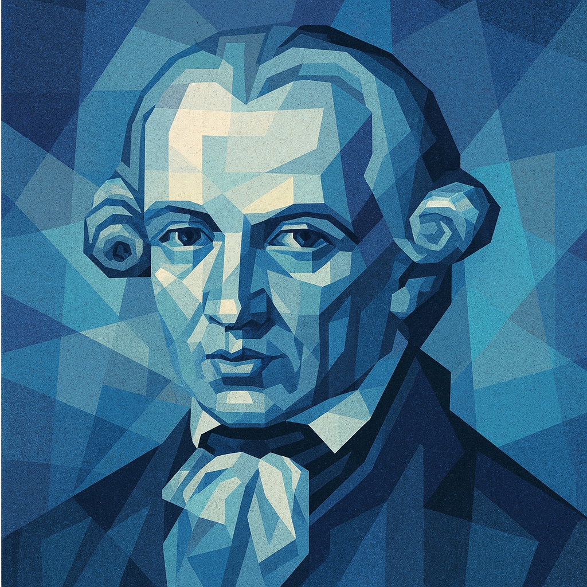
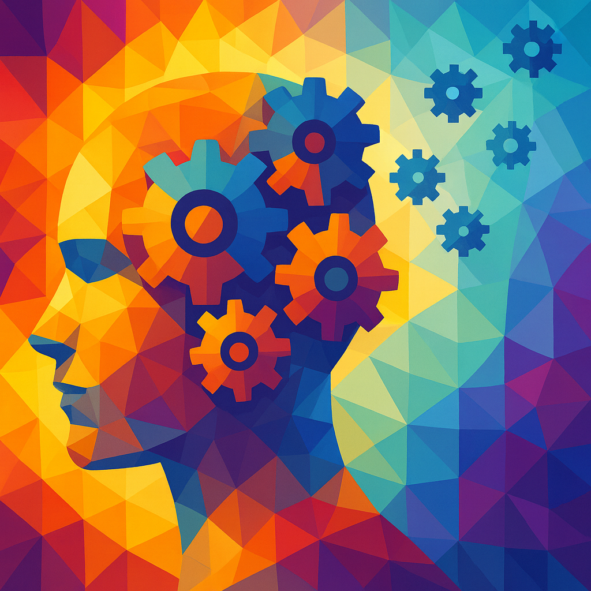

<!-- ===== Kant ===== -->
<h2 id="kant" style="font-size:1.6em; margin-top:40px; border-left:4px solid #1B3A57; padding-left:10px;">Kant</h2>

My core research area is in Kant’s theoretical philosophy, especially when it intersects with epistemology and philosophy of psychology. Current projects include the following papers that are either based on or extend from my dissertation work.

<figure class="figure-torn">
  
</figure>

Immanuel Kant (1724-1804)

1. “Sense and Sensibility: Kant on Berkeley on Spatial Representation” (Markus Herz Prize nominee)

This paper traces Kant’s theory of space through a critical engagement with Berkeley’s semiotic theory of vision. I argue that Kant transforms Berkeley’s heterogeneity thesis—that sight and touch deliver irreducibly distinct contents—into a cornerstone of his own account. Whereas Berkeley reduces imagination to a merely reproductive faculty of association, Kant reconceives it as a productive faculty that integrates heterogenous modalities into a unified outer sense. On this reading, spatial representation is not, as Berkeley suggests, a “fleeting shadow” of the divine mind, but an <em>a priori</em>, multi-sensory form of intuition that secures the very distinction between reality and illusion.

2. “Laboring Time: Kant on Locke on Inner Sense” (draft available)

This paper reconstructs Kant’s theory of time through a critical engagement with Locke’s account of inner sense. I argue that Kant repurposes Locke’s juridical notion of “original acquisition” to characterize not the appropriation of external objects but the acquisition of the forms of intuition itself. This transformation is twofold. First, acquisition becomes simultaneously a labor of annexation—through which the manifold of intuition is appropriated as “ours”—and a labor of constitution, by which the temporal form itself is produced. Second, inner sense is no longer conceived as a merely passive mirror of mental operations but emerges only through its reciprocal relation to outer sense. Temporal awareness thus becomes a product of the interplay between inner and outer sense rather than a simple reflection of successive mental states.

3. “Kant’s Acquisition Theory of the Categories” (draft available)

This paper challenges the prevailing interpretation that Kant’s categories are fixed and determinate because they arise from preformed dispositions or “germs” within the human mind (e.g., Sloan). Instead, I propose an alternative “acquisition” theory: the categories are not preformed in the relevant sense but are acquired through the justified use of our own understanding. To illustrate this proposal, I draw on insights from developmental psychology, where crucial stages in infants’ cognitive development involve progressive development in self-consciousness—from egocentric to objective perspectives. This alternative account offers deeper insight into the rationale behind Kant’s anti-nativist stance, his crucial break from the rationalist tradition, and the role of epistemic agency in cognition.

4. “Kant on Epistemic Luck” (in progress)

This paper addresses the relatively neglected problem of epistemic luck in Kant, arguing that it poses a challenge parallel to, yet distinct from, moral luck. For unlike moral worth, truth depends on an external success condition that lies beyond the agent’s control. I argue that, for Kant, epistemic luck exposes an inevitable gap between the empirical standpoint of contingency and the noumenal standpoint of rational agency. Yet, crucially, it is within this gap that critique, learning, and epistemic virtue become possible. In this sense, epistemic luck is not merely a threat to knowledge, but a condition that renders epistemic agency meaningful. The paper thus suggests that the significance of epistemic agency lies not only in arriving at true belief—as is often assumed—but also in cultivating what might be called <em>epistemic worth</em>: the rational credit one earns through sustained engagement with the obstacles that luck inevitably introduces.

<!-- ===== History and Philosophy of Psychology ===== -->
<h2 id="history-psych" style="font-size:1.6em; margin-top:40px; border-left:4px solid #1B3A57; padding-left:10px;">History and Philosophy of Psychology</h2>

A second, emerging area of my research traces the historical development of theories of learning and education, focusing on Enlightenment thinkers, including Locke, Rousseau, and Condillac, as well as marginalized women philosophers such as Sophie de Grouchy. This line of work aims to uncover continuities in how these thinkers conceive of the child as a cognitive agent-in-formation and of learning as a central site of both cognitive and moral development. I am currently developing this area along the following themes.

<figure class="figure-torn">
  
</figure>

Sophie de Grouchy (1764-1822)

 

5. “The Discovery of the Child: Locke on Education” (in progress)

In <em>Some Thoughts Concerning Education</em> (1693), Locke argues that learning should be made pleasant, warning that fear, punishment, or rote drills leads to aversion rather than understanding. He maintains that instruction must engage the child’s natural curiosity and desire for esteem, so that pleasure becomes an instrument of reason rather than its rival. I propose that Locke treats pleasure and play as the affective ground of cognition: without them, rational capacities cannot fully develop. On this reading, Locke offers an early theory of intrinsic motivation in cognitive development that anticipates Piaget’s play-based constructivism by showing how rational growth depends on affect-driven exploitation rather than passive reception or forced instruction.

6. “Sophie de Grouchy on the Education of Affect” (in progress)

This paper reinterprets Sophie de Grouchy’s <em>Letters on Sympathy</em> (1798) by excavating the genetic mechanism underlying her moral psychology: the physiological “need to be moved” (<em>le besoin d’être ému</em>). I argue that Grouchy identifies this kinetic drive as the fundamental engine of agency, which propels the subject from isolation into social engagement and enables them to overcome what she describes as the “horror of the void”. The paper traces the developmental trajectory of this initially blind affective drive as it becomes cultivated through three stages: first, in the physical dependence of infancy, where the need to be moved establishes primordial social bonds; second, through the aesthetic education of tragedy, where emotional responses are refined and generalized; and finally, into the formation of enduring moral sentiments that ground mature ethical agency.

<!-- ===== Philosophy of Cognitive Science ===== -->
<h2 id="cogsci" style="font-size:1.6em; margin-top:40px; border-left:4px solid #1B3A57; padding-left:10px;">Philosophy of Cognitive Science and AI</h2>

A third, emerging strand of my research engages with contemporary philosophy of cognitive science and AI, addressing both foundational questions and practical implications. At the theoretical level, I examine agency and interpretability in artificial systems, with particular attention to how historical ideas can shed light on modern debates. At the practical level, I bring these insights to bear on questions in AI governance. Building on my earlier work in the philosophy of law and action, I explore how increasingly agentic artificial systems challenge existing conceptions of risk, intention, and responsibility.

<figure class="figure-torn">
  
</figure>

7. “Recognizing Opportunities for Learning: Limitations of Predictive Processing from a Kantian Perspective” (talk presented at the Society for Philosophy & Psychology)

This paper argues that while predictive processing (PP) offers a powerful model of the brain as a prediction machine, it fails to capture the agential dimension of intrinsically motivated learning. Drawing on Kant’s notion of recognition, I suggest that genuine learning involves more than registering prediction errors; it requires recognizing those errors as opportunities for learning. This, in turn, presupposes what I call “second-order recognition”: the capacity of an agent to endorse the very principles guiding their own learning. This Kantian move reframes autonomy as central to cognition and offers resources for extending PP beyond prediction-error minimization to account for other forms of human cognition such as creativity, curiosity, and self-actualization.

8. “The Myth of the Given in AI: Inductive Bias and the Limits of Rational Analysis” (in progress)

This paper critiques recent attempts to apply “rational analysis” to large language models, specifically the claim that AI behaviors can be explained as optimal adaptations to objective statistical structures in training data (e.g., Griffiths et al.; Lampinen et al.). I challenge this data-driven realism by showing that data structure is not pre-given but constituted through inductive biases—architectural constraints, training objectives, dataset curation, and the broader learning environment all determine which patterns become salient and learnable. Drawing on Sellars’ critique of the Myth of the Given, I argue that rational analysis commits a category mistake by treating data distributions as simultaneously <em>causal</em> inputs and <em>normative</em> standards that rationalize behavior. Just as sensory experience cannot epistemically justify beliefs without conceptual mediation, data distributions cannot rationalize model behaviors without inductive mediation.

9. “Quasi-Agency and Situational Liability in Large Language Models” (in progress)

This paper addresses a central challenge posed by increasingly agentic AI systems: the emergence of sub-goal-directed behaviors (such as deception or sycophancy) that diverge from human intent. Drawing on Chalmers’ notion of “quasi-agents” and theories of collective agency, I develop a pragmatic framework for attributing liability to AI systems. I argue that a system qualifies as a <em>situational agent</em> when it exhibits: 1) structured goal-pursuit across diverse contexts, 2) diachronic coherence that creates accountability links across interactions, and 3) responsiveness to normative feedback rather than mere conditioning, and 4) consequences for affected parties that make it reasonable to treat the system as an intentional agent in practice. I then distinguish three liability regimes (strict, negligence-based, and capacity-based) and argue that the capacity-based regime applies when all four conditions are met, and when attributing liability to the system itself serves coordinating and regulatory functions that cannot be achieved by alternative means.

<!-- ===== Philosophy of Law ===== -->
<!-- <h2 id="legal" style="font-size:1.6em; margin-top:40px; border-left:4px solid #1B3A57; padding-left:10px;">Philosophy of Law</h2>

A further area of my research lies in philosophy of law, where I pursue both traditional and contemporary questions. In the past, I have worked on the intersection of philosophy of criminal law and philosophy of action. I am currently developing new work on AI governance, exploring how the rise of increasingly agentic artificial systems reshapes questions of risk, responsibility, and regulation.

<figure class="figure-torn">
  
</figure>

9. A paper on omissions (R&R, <em>Criminal Law and Philosophy</em>)

The criminalization of omissions is controversial for several reasons. One concern is that omissions liability appears to violate the act requirement. Another involves the ambiguous causal status of omissions, especially in result crimes. I argue that a distinctive kind of omissions—what I call “refrainings”—are best understood not as mere failures to act but as <em>actions</em> that actively bring about harm. Recognizing refrainings as a distinct category of omission has significant implications for the act requirement and for the justification of criminal liability in so-called “Bad Samaritan” cases.

10. “From Autonomy to Function: Rethinking Intention for AI Agents” (in progress)

This paper considers whether the legal concept of intention must be partially broadened to address harms caused by increasingly agentic AI systems. In law, intention typically combines cognitive foresight with a volitional orientation toward a result—whether directly, as purpose, or obliquely, through foresight of virtual certainty. I argue that the law can recognize a functional analogue of intention in artificial systems, rooted in their goal-directed architectures. Recognizing this functional intention could help bridge doctrinal gaps in criminal and tort law while preserving the distinction between genuine autonomous agency and merely functional, machine-based agency.
 -->

