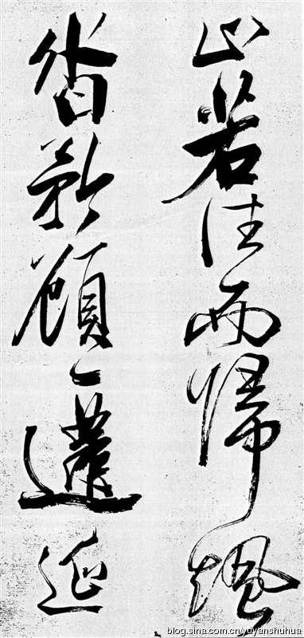

  <!-- 左边文字 -->
  

    <h2 id="calligraphy" class="section-title">Calligraphy</h2>
    

      I study East Asian calligraphy as a meditative practice and as an extension of aesthetic 
      philosophy. The discipline of brushwork reflects balance, patience, and form that resonates 
      with philosophical inquiry.
    

    <h2 id="pottery" class="section-title">Pottery</h2>
    

      Pottery connects material craft with timelessness—shaping clay mirrors shaping thought. 
      My explorations in ceramics highlight texture, imperfection, and the philosophy of wabi-sabi.
    

    <h2 id="sake" class="section-title">Sake</h2>
    

      I study the cultural and ritual significance of sake in Japanese tradition, connecting 
      artisanal brewing with ideas of community, ceremony, and philosophical reflection on taste.
    

  

  <!-- 右边图片 -->
  

    
    
Example

  

